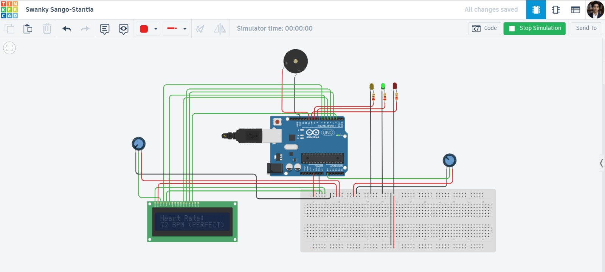

# Arduino Heart Rate Monitoring and Alert System

## 📌 Overview
This project is an Arduino-based health monitoring system that simulates heart rate using an analog input and displays real-time BPM.

## ⚙️ Features
- Real-time BPM display on LCD
- Condition classification (Low, Normal, Critical)
- LED indicators for status
- Buzzer alert for critical condition

## 🧠 Working Principle
Analog input from a potentiometer is mapped to realistic BPM values (40–140 BPM). Based on the BPM range, the system triggers corresponding outputs.

## 🛠️ Components Used
- Arduino Uno
- 16x2 LCD
- Potentiometer (2x)
- LEDs (Green, Yellow, Red)
- Buzzer
- Resistors

## 🔌 Circuit

## 🔗 Live Simulation
[View Project on Tinkercad](https://www.tinkercad.com/things/l6t6g70laSu-heart-rate-monitoring-and-alert-system-using-arduino/)

## 💡 Future Improvements
- Replace the potentiometer with a real pulse sensor
- IoT integration for remote monitoring

## 🚀 Author
MD Ziyaad Ul Hasan Ansari
